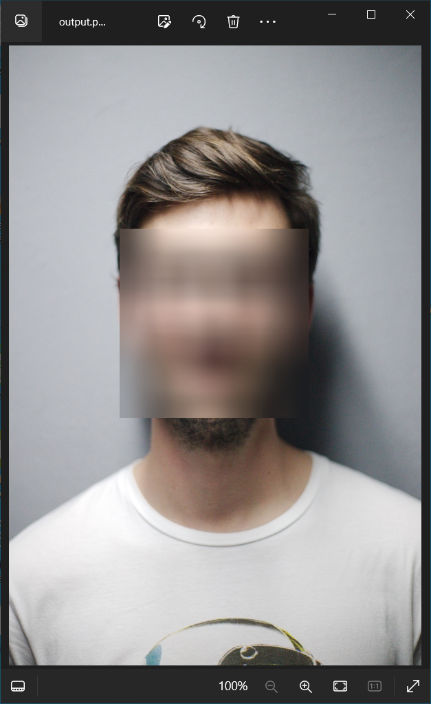
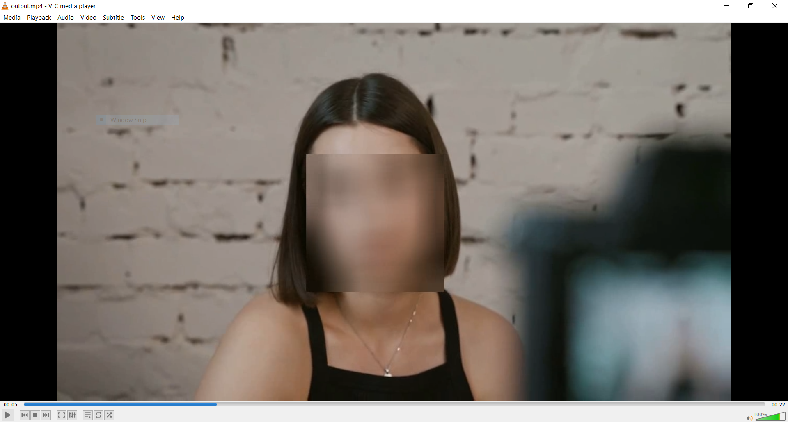
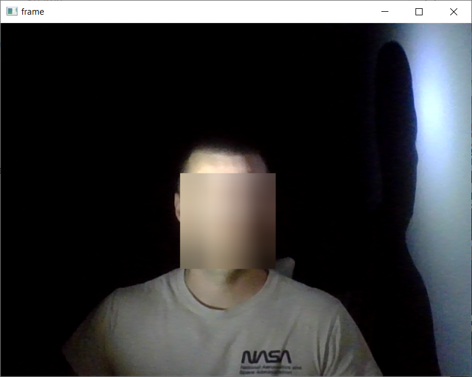

# face-detection-and-blurring

Face detection and blurring the face/faces using python, opencv, and mediapipe. Three imput modes: image, video, web-cam. The script outputs image, video, or web-cam stream with blurred faces respectively.

# how to install

$ pip install -r requirements.txt

# how to use

$ python main.py --mode --filePath

mode: image, vidoe, webcam

filePath: path to your image or video

# screenshot examples

image-example

vidoe-example

web-cam-example

# note

./data folder contains test video and test image

after running the script with --video or --image flags, script will make ./output folder
and will same output file there